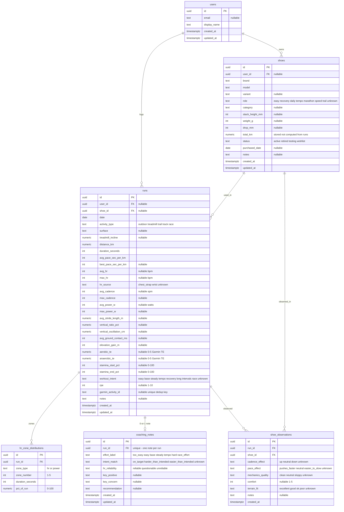
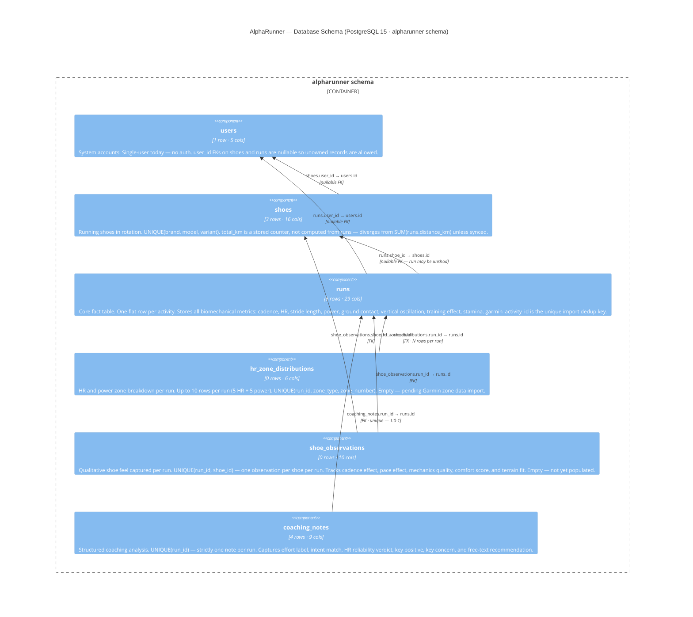
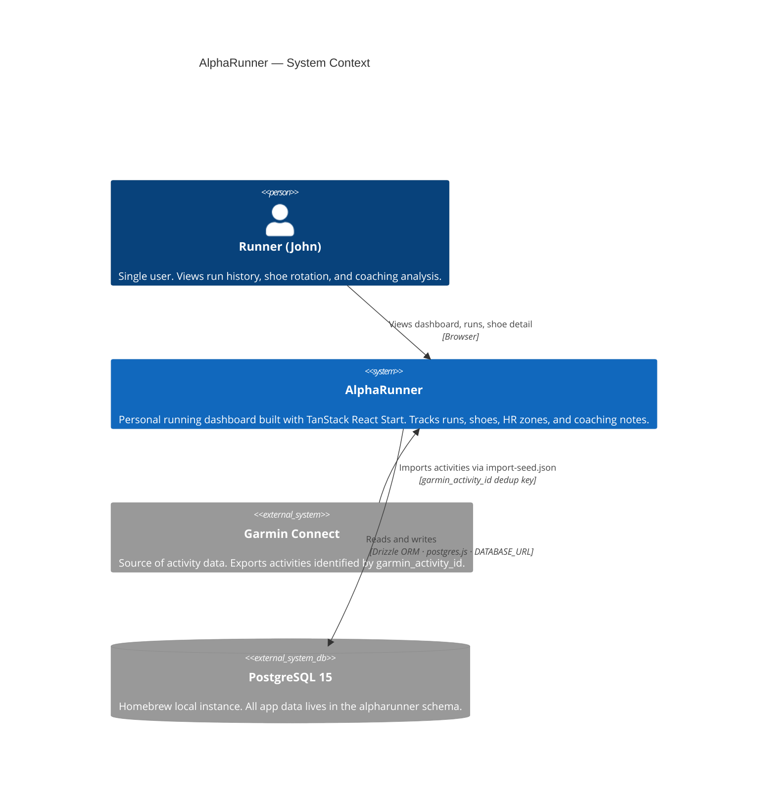
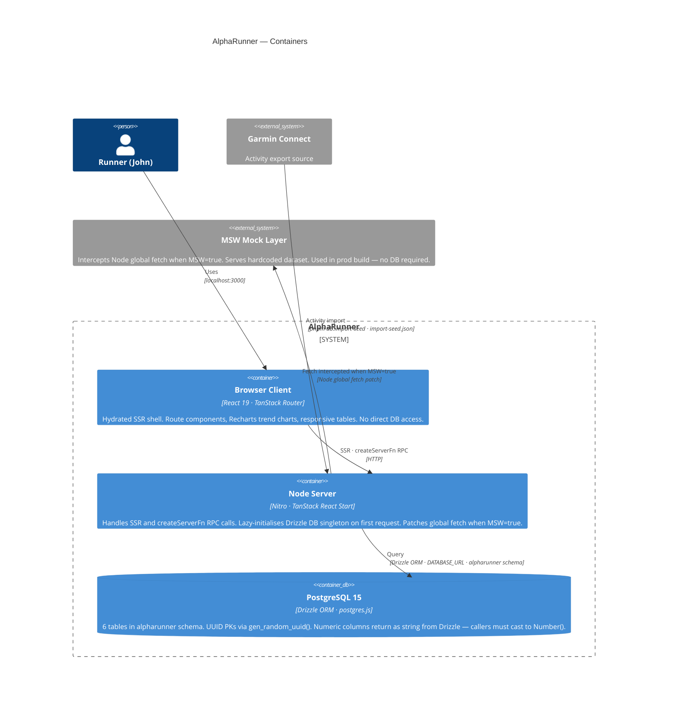
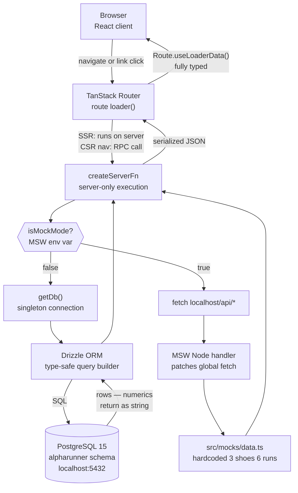
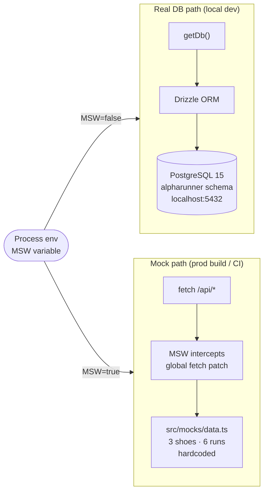

# AlphaRunner — Backend Architecture

## Stack

| Layer | Technology |
|---|---|
| Framework | TanStack React Start 1.145 (full-stack SSR, Nitro server) |
| Database | PostgreSQL 15 via `postgres` JS driver |
| ORM | Drizzle ORM 0.45 |
| Schema management | Drizzle Kit 0.31 |
| Validation | Zod 4 + drizzle-zod |
| Build | Vite 7 + Nitro |
| Mock layer | MSW 2 (intercepted in both browser and Node) |

---

## Data Model

All tables live in the `alpharunner` PostgreSQL schema (not `public`). Every table uses UUID primary keys generated by `gen_random_uuid()` in the database.

### Entity Relationship



#### C4 Component — database schema

Each table as a C4 component: purpose, row count, column count, key constraints, and every FK labeled with the exact source → target column:



### `users`

| Column | Type | Nullable | Default |
|---|---|---|---|
| id | uuid PK | no | gen_random_uuid() |
| email | text | yes | — |
| display_name | text | no | — |
| created_at | timestamptz | no | now() |
| updated_at | timestamptz | no | now() |

One row in current seed. Currently no auth — user is fetched with `findFirst()`.

---

### `shoes`

| Column | Type | Nullable | Notes |
|---|---|---|---|
| id | uuid PK | no | |
| user_id | uuid FK→users | yes | nullable for unowned shoes |
| brand | text | no | |
| model | text | no | |
| variant | text | yes | e.g. "2", "41" |
| role | text | no | default `unknown` |
| category | text | yes | |
| stack_height_mm | integer | yes | |
| weight_g | integer | yes | |
| drop_mm | integer | yes | |
| total_km | numeric(10,2) | no | default 0 — manually maintained, not computed |
| status | text | no | default `active` |
| purchased_date | date | yes | |
| notes | text | yes | |
| created_at | timestamptz | no | |
| updated_at | timestamptz | no | |

**Indexes:** `shoes_user_id_idx`, `shoes_status_idx`, unique composite on `(brand, model, variant)`.

**`role` values:** `easy` `recovery` `daily` `tempo` `marathon` `speed` `trail` `unknown`

**`category` values:** `super_trainer` `daily_trainer` `performance` `recovery` `lightweight` `speed`

**`status` values:** `active` `retired` `testing` `wishlist`

**Important:** `total_km` is a stored field, not computed from `runs`. The dashboard's shoe averages panel computes live distance by summing `runs.distance_km` via a `LEFT JOIN`, so the two numbers will diverge unless kept in sync manually or via trigger.

---

### `runs`

The core table. Every run is a single record — no splits, laps, or GPS path data.

| Column | Type | Nullable | Notes |
|---|---|---|---|
| id | uuid PK | no | |
| user_id | uuid FK→users | yes | |
| date | date | no | |
| activity_type | text | no | |
| surface | text | yes | free text |
| treadmill_incline | numeric(4,1) | yes | percent grade |
| distance_km | numeric(8,2) | no | |
| duration_seconds | integer | no | |
| avg_pace_sec_per_km | integer | no | |
| best_pace_sec_per_km | integer | yes | |
| avg_hr | integer | yes | bpm |
| max_hr | integer | yes | bpm |
| hr_source | text | no | default `unknown` |
| avg_cadence | integer | yes | steps per minute |
| max_cadence | integer | yes | |
| avg_power_w | integer | yes | watts |
| max_power_w | integer | yes | |
| avg_stride_length_m | numeric(5,2) | yes | |
| vertical_ratio_pct | numeric(5,2) | yes | |
| vertical_oscillation_cm | numeric(5,2) | yes | |
| avg_ground_contact_ms | integer | yes | |
| elevation_gain_m | integer | yes | |
| aerobic_te | numeric(3,1) | yes | Garmin Training Effect 0–5 |
| anaerobic_te | numeric(3,1) | yes | Garmin Training Effect 0–5 |
| stamina_start_pct | integer | yes | 0–100 |
| stamina_end_pct | integer | yes | 0–100 |
| workout_intent | text | no | default `unknown` |
| rpe | integer | yes | 1–10 |
| garmin_activity_id | text | yes | unique — deduplication key for Garmin imports |
| shoe_id | uuid FK→shoes | yes | nullable — unshod runs allowed |
| notes | text | yes | |
| created_at | timestamptz | no | |
| updated_at | timestamptz | no | |

**Indexes:** `runs_user_id_idx`, `runs_date_idx`, `runs_activity_type_idx`, `runs_shoe_id_idx`, unique on `garmin_activity_id`.

**`activity_type` values:** `outdoor` `treadmill` `trail` `track` `race`

**`hr_source` values:** `chest_strap` `wrist` `unknown`

**`workout_intent` values:** `easy` `base` `steady` `tempo` `recovery` `long` `intervals` `race` `unknown`

---

### `hr_zone_distributions`

One row per zone per run. A run will have up to 5 HR zone rows and/or up to 5 power zone rows.

| Column | Type | Nullable | Notes |
|---|---|---|---|
| id | uuid PK | no | |
| run_id | uuid FK→runs | no | |
| zone_type | text | no | `hr` or `power` |
| zone_number | integer | no | 1–5 |
| duration_seconds | integer | no | |
| pct_of_run | numeric(5,2) | no | 0–100 |

**Unique:** `(run_id, zone_type, zone_number)` — one row per zone per type per run.

**Current rows:** 0. Table is defined and ready; no Garmin zone data has been imported yet.

---

### `shoe_observations`

Qualitative shoe-performance assessment attached to a specific run. Written when you want to note how the shoe felt during that session.

| Column | Type | Nullable | Notes |
|---|---|---|---|
| id | uuid PK | no | |
| run_id | uuid FK→runs | no | |
| shoe_id | uuid FK→shoes | no | |
| cadence_effect | text | no | default `unknown` |
| pace_effect | text | no | default `unknown` |
| mechanics_quality | text | no | default `unknown` |
| comfort | integer | yes | 1–5 |
| terrain_fit | text | no | default `unknown` |
| notes | text | yes | |
| created_at | timestamptz | no | |

**Unique:** `(run_id, shoe_id)` — one observation per shoe per run.

**`cadence_effect`:** `up` `neutral` `down` `unknown`

**`pace_effect`:** `pushes_faster` `neutral` `easier_to_slow` `unknown`

**`mechanics_quality`:** `clean` `neutral` `sloppy` `unknown`

**`terrain_fit`:** `excellent` `good` `ok` `poor` `unknown`

**Current rows:** 0.

---

### `coaching_notes`

Structured coaching analysis for a run — one note max per run (enforced by unique index on `run_id`).

| Column | Type | Nullable | Notes |
|---|---|---|---|
| id | uuid PK | no | |
| run_id | uuid FK→runs | no | unique |
| effort_label | text | no | |
| intent_match | text | no | default `unknown` |
| hr_reliability | text | no | default `questionable` |
| key_positive | text | yes | |
| key_concern | text | yes | |
| recommendation | text | yes | |
| created_at | timestamptz | no | |
| updated_at | timestamptz | no | |

**`effort_label`:** `too_easy` `easy` `base` `steady` `tempo` `hard` `race_effort`

**`intent_match`:** `on_target` `harder_than_intended` `easier_than_intended` `unknown`

**`hr_reliability`:** `reliable` `questionable` `unreliable`

**Current rows:** 4 (seeded for runs with non-null coaching notes).

---

## Database Layer (`src/db/`)

### Connection (`src/db/index.ts`)

`getDb()` is an async function that returns a singleton Drizzle instance. It:

- Throws if called on the client (`globalThis.window` guard)
- Lazily imports `drizzle-orm/postgres-js` and `postgres` — no top-level module side effects
- Reads `DATABASE_URL` from env at first call
- Caches the client in module-scope `_db`

The function is safe to call from multiple server functions in the same request; they all get the same singleton.

Re-exports everything from `schema.ts` and `validators.ts` so call sites do `import { getDb, runs, shoes, runSchema } from '~/db'`.

### Schema (`src/db/schema.ts`)

Declares all tables using `pgSchema("alpharunner")` which scopes every table to the `alpharunner` PostgreSQL schema. Drizzle relations are declared separately from table definitions using `relations()` — these drive the `with:` option in `db.query.*` calls (Drizzle's relational query API).

Numeric fields (distances, paces stored as `numeric`) come back from Drizzle as `string` — callers must `Number(...)` them. This is a Drizzle design choice for precision.

### Validators (`src/db/validators.ts`)

Zod schemas for every insertable entity, built from `createInsertSchema` (drizzle-zod) then extended with explicit enums and coercions. All `id`, `createdAt`, `updatedAt` fields are omitted — they're generated by the DB or set in code.

These are ready to use for API input validation but are not currently wired to any HTTP endpoint (no REST API exists yet).

### Migrations (`supabase/migrations/`)

The migration directory is named `supabase/` for historical reasons — the project was originally targeting Supabase. It now targets local PostgreSQL. The migration SQL in `0000_worthless_risque.sql` references the `public` schema in FK definitions, which conflicts with the current `pgSchema("alpharunner")` setup. **Use `pnpm db:push` for local schema changes**, not `db:migrate`, until the migration files are regenerated against the alpharunner schema.

### Seed Import (`src/db/import-seed.ts`)

Reads `../import-seed.json` (relative to the `alpharunner/` directory, so at the repo root). Uses SHA1-based `stableUuid()` to convert short string IDs (e.g. `"mock-run-1"`) to deterministic UUIDs — the mapping is printed on success. Re-runnable: upserts users and shoes, deletes-then-reinserts dependent rows (hr_zones, shoe_observations, coaching_notes) per run.

---

## Server Architecture

### C4 Context — system in the world



### C4 Container — runtime components



### No REST API

There are no Express routes, Hono handlers, or API route files. Data fetching happens exclusively through **TanStack `createServerFn`** — TypeScript functions that run on the server but are called directly from route loaders as if they were plain async functions. The framework serializes the return value over HTTP automatically.

### Request Lifecycle



No explicit `fetch()` calls, no `/api/` routes, no serialization boilerplate for the real-DB path.

### Routes (`src/routes/`)

#### `__root.tsx`
Layout shell. Loads `runtimePort` from `process.env.PORT` via its own server function. Renders the nav header and `<Outlet />`.

#### `index.tsx` → `/`
**`getDashboardData()`** fires 6 database queries:

1. `users.findFirst` with `runs` (last 5, `DESC date`) and nested `shoe` — Drizzle relational query
2. `COUNT(*)` on `runs`
3. `COUNT(*)` on `shoes`
4. `COUNT(*)` on `coaching_notes`
5. `COUNT(*)` on `hr_zone_distributions`
6. `SUM(distance_km)` on `runs`
7. Shoe averages: `shoes LEFT JOIN runs GROUP BY shoes.id` — computes live distance sum, run count, avg cadence/HR/pace
8. `coaching_notes` fetched for the 5 recent run IDs via `inArray`, assembled into a map

These run sequentially (not in a transaction). For a personal dashboard the chattiness is fine; if this grows, bundle into fewer queries or a single SQL function.

#### `runs.tsx` → `/runs`
**`getRunsOverview()`** fires 2 queries:

1. `runs.findMany` ordered `ASC date` with `shoe` relation — full table scan
2. Aggregate `SELECT` for count, total distance, avg cadence/pace/stride

Returns raw rows mapped to `TrendChartPoint[]` for the Recharts trend chart, plus a summary object.

#### `shoes.$shoeId.tsx` → `/shoes/:shoeId`
**`getShoeDetail(shoeId)`** fires 2 queries:

1. `shoes SELECT` filtered by `eq(shoes.id, shoeId)` — throws if not found
2. `runs SELECT` filtered by `eq(runs.shoeId, shoe.id)` ordered `ASC date`

The shoe's `totalKm` is read from the `shoes` table (the stored value), while the trend chart reflects actual logged runs. These can diverge.

---

## Dual-Mode Operation (Real DB vs MSW)

The `MSW` environment variable controls which data path runs:

```
MSW=true  → isMockMode() returns true
           → server functions fetch from http://localhost:<PORT>/api/*
           → MSW intercepts those requests and returns mock data from src/mocks/data.ts
           → no database connection is made

MSW=false → isMockMode() returns false
           → server functions call getDb() and query PostgreSQL directly
```

The MSW server (`src/mocks/server.ts`) patches Node's global `fetch` at startup via `initializeMockServer()` called from `src/server.ts`. A module-scope guard prevents double-initialization on HMR re-evaluations.

Mock data lives in `src/mocks/data.ts` — 3 shoes, 6 runs, matching the seed data in `import-seed.json`.

### Environment profiles

| File | MSW | Port | DATABASE_URL | Use |
|---|---|---|---|---|
| `env-profiles/local.env` | false | 3000 | postgresql://john@localhost:5432/alpharunner | Local dev with real DB |
| `env-profiles/prod.env` | true | 3120 | (empty) | Production build, mock data only |

Scripts inject the right profile via `dotenv -e ../env-profiles/<file>.env --`.



---

## Build and Scripts

```
pnpm dev              # local.env, real DB, port 3000
pnpm dev:msw          # local.env but forces MSW=true
pnpm build            # builds against local.env
pnpm build:prod       # builds against prod.env (MSW mode)

pnpm db:push          # apply schema to DB via drizzle-kit push (local.env)
pnpm db:push:prod     # apply schema to DB via drizzle-kit push (prod.env)
pnpm db:generate      # generate migration SQL from schema diff
pnpm db:migrate       # apply pending migrations (local.env)
pnpm db:studio        # open Drizzle Studio UI (local.env)
pnpm db:import-seed   # run import-seed.ts against ../import-seed.json
```

The built server outputs to `.output/server/index.mjs`. The `postgres` package is marked external and not bundled by Nitro.

---

## Extension Points

### Adding a new route with DB data

1. Create `src/routes/your-route.tsx`
2. Define a `createServerFn` that calls `getDb()` and queries
3. Wire it to `Route = createFileRoute('/your-route')({ loader: () => yourFn() })`
4. No registration needed — TanStack Router picks up file-based routes automatically

### Adding a REST API endpoint

TanStack React Start supports API routes via files in `src/routes/api/`. Create `src/routes/api/your-endpoint.ts` and export a `createAPIFileRoute` handler. These run server-only and support standard `Request`/`Response`. Validators from `src/db/validators.ts` can be used directly for request body parsing.

### Adding a new table

1. Add the table definition to `src/db/schema.ts` using `alpharunner.table(...)`
2. Add Drizzle relations if needed
3. Add a Zod validator to `src/db/validators.ts`
4. Run `pnpm db:push` (local) or `pnpm db:generate && pnpm db:migrate` (migration-tracked)
5. Export the table from `src/db/index.ts` re-exports automatically via `export * from './schema'`

### Wiring real auth

`users.id` is already on `runs` and `shoes` as nullable FKs. The current code fetches `users.findFirst()` with no filter. To add auth:

- Add a session lookup before `findFirst` and filter by `eq(users.id, sessionUserId)`
- Make `user_id` non-nullable on the application side (the FK is already there)
- The Zod schemas already have `user_id` fields ready

### Adding Garmin import

`runs.garmin_activity_id` has a unique index — safe to use as an idempotency key. An import job would:
1. Parse Garmin activity JSON/FIT export
2. Call `import-seed.ts`-style upsert logic keyed on `garmin_activity_id`
3. Populate `hr_zone_distributions` from the zone data (table is empty, schema is ready)

### Replacing the mock layer

To remove MSW entirely: delete the `isMockMode()` branch from each server function and remove the `src/mocks/` directory and the `initializeMockServer()` call in `src/server.ts`. The real-DB path is the only other branch. The `MSW` env var in `prod.env` is currently the only thing keeping production from requiring a database.

---

## Known Gaps

- **`shoes.total_km` is not computed** — it is a manually-maintained field. The dashboard's shoe averages live-compute distance from `runs`, so they will disagree with `total_km` unless you add a trigger or update script.
- **No auth** — a single user is assumed. `user_id` FKs on `runs` and `shoes` are nullable; there is no session or token check anywhere.
- **No HTTP API** — all data access is via `createServerFn`. There is no way to call this from a mobile app, CLI, or third-party integration without adding API routes.
- **`supabase/migrations/` SQL targets `public` schema** — FK references in `0000_worthless_risque.sql` use `"public"."runs"` etc., inconsistent with the live `alpharunner` schema. Regenerate with `pnpm db:generate` before using `db:migrate`.
- **`hr_zone_distributions` and `shoe_observations` are empty** — the tables exist and are seeded with 0 rows. The UI has no views for them yet.
- **Production has no database** — `prod.env` has `DATABASE_URL` empty and `MSW=true`. Any production deployment that wants real data needs a hosted Postgres and a filled `DATABASE_URL`.
